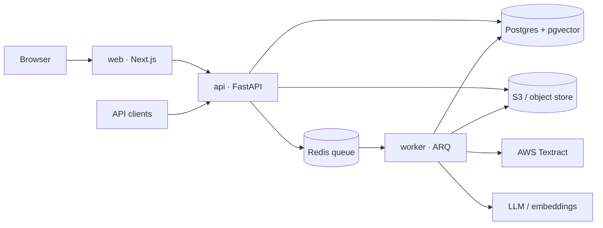
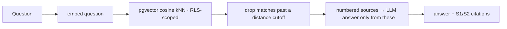
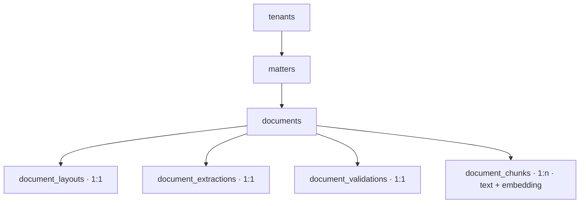

# Document Intelligence Pipeline

*Turn contracts and business documents into structured, validated, queryable data — with a human in the loop.*

---

Teams sitting on a pile of contracts and business documents have the same
problem: the information they need is locked in prose, and reading it out by hand
doesn't scale. This is a working pipeline that ingests those documents, extracts
the key fields into a typed schema with a **confidence score and a supporting
quote on every value**, runs them through validation rules, and routes anything
uncertain to a person. Once processed, a document is also searchable — ask
questions across the whole corpus in plain language and get answers **cited back
to the exact page**. It's built like a production system: tenant isolation
enforced in the database, a typed and tested codebase, every model call behind a
swappable seam.

## TL;DR

- **Ingest** any PDF / scan / image — deduplicated by content hash, classified, OCR'd with layout.
- **Extract** to a schema — every field carries a value, a confidence, and the verbatim quote it came from.
- **Validate** with deterministic rules + a confidence gate → `passed` or `needs review`.
- **Ask** questions across every processed document; answers cite the source document and page, and show the exact text the model was given.
- **Multi-tenant** from the ground up — row-level security in Postgres, not application `if`s.
- **Reproducible** — a synthetic document generator produces a labelled test corpus and powers a one-click demo.

---

## What it does


You upload a document and get an immediate response; the slow work happens in the
background. When it finishes you have: the document classified, its fields
extracted into a schema (each with a confidence and a supporting quote), a
validation verdict telling you whether a human needs to look at it, and the
document indexed so you can ask questions across it and everything else you've
processed.

The review UI lists every document with its verdict, shows the page scans next to
the extracted fields with the shaky ones highlighted, and has an **Ask** box —
per document or across the whole corpus — that answers with citations and shows
the passages it used.

## Screenshots

_Review UI — document list with verdicts, the extraction + validation view, and
the Ask panel with its retrieved chunks._

<!--


-->

---

## Technical deep dive

For engineers building OCR extraction and adding retrieval on top of it — the
decisions here are the interesting part, not the framework choices.

### Architecture



An HTTP API and a background worker share one codebase and one Postgres database
(with `pgvector`). Uploads return immediately; the worker does the expensive work
— rasterization, OCR, LLM calls, embeddings — off the request path, pulling jobs
from Redis. A Next.js app is the read surface.

### The pipeline, stage by stage

**Ingestion.** File type comes from magic bytes, not the extension. A content
SHA-256 means a re-upload of the same bytes is recognized, not reprocessed. For
PDFs a quick pass decides digital-vs-scanned. Bytes go to object storage keyed by
hash, a row goes to Postgres, and a job goes to the queue.

**OCR & layout.** Every page is rasterized and sent to AWS Textract's LAYOUT
analysis. The result is normalized into one shape regardless of engine: pages →
blocks, each block carrying its text, a role (`title`, `section_header`, `text`,
`footer`, …), a bounding box (0–1 of the page), and the engine's own confidence.
That normalized layout is the single source of truth every later step reads from
— nothing re-OCRs.

**Classification.** The first page's text goes to a small, cheap model call that
returns a document type and a confidence. Best-effort: if it fails, the document
still completes — it just isn't typed.

**Structured extraction.** For a known type, the full text goes to a model bound
to a schema. Every field comes back wrapped as `{ value, confidence, evidence }`
— the value, how sure the model is, and the verbatim quote it read it from. That
wrapper is deliberate: a field with no value and low confidence is a different
thing from a confidently-absent one, and the next step needs to tell them apart.

**Validation.** Pure, deterministic rules run over the extracted fields — is
there a governing-law clause, does every named party have a signature block, is
the expiry after the effective date, are the required fields present — plus a
confidence gate that flags any field below a threshold. The output is a verdict
(`passed` / `needs review`) and a list of issues. This is the human-in-the-loop
gate: a clean document passes untouched; anything with an error or a shaky field
is surfaced.

**Indexing.** The layout text is split into overlapping ~256-token windows
(paragraph- and sentence-aware, headers and footers dropped), each tagged with
the page it starts on. Each window is embedded and stored in `pgvector`
alongside its text.

### Answering a question



The question is embedded with the same model, then it's a single SQL query:
nearest chunks by cosine distance, scoped to the tenant by row-level security,
optionally narrowed to one document, with anything past a distance threshold
dropped so an off-topic question returns nothing rather than citing noise. The
retrieved passages are numbered and handed to a model told to answer only from
them and cite `[S1]`, `[S2]`. The UI shows the answer and, below it, the exact
chunks that were sent — page, distance, full text — so retrieval is auditable,
not a black box.

### Design decisions worth copying

**Multi-tenancy is a database concern.** Every tenant-scoped table has
`ENABLE ROW LEVEL SECURITY` + `FORCE ROW LEVEL SECURITY` and a policy keyed on a
per-transaction session variable. The application connects as a non-superuser
role and sets the current tenant at the start of each request's transaction. A
query in tenant A's context physically cannot read or write tenant B's rows —
there is no code path that forgets the tenant filter, because the filter isn't in
application code.

**One datastore.** Vectors live in the same Postgres as everything else, via
`pgvector`. Retrieval, the tenant filter, and the join back to the document all
happen in one SQL statement, in one transaction, behind the same row-level
security. A dedicated vector database would mean a second system to keep in sync
and its own way of enforcing isolation. `pgvector` with an HNSW index is
comfortably fast well past the scale this needs.

**Retrieval stays raw SQL — on purpose.** LangChain does the chunking and the
embedding calls, where its abstractions genuinely save code. It does *not* do
retrieval: its Postgres vector store manages its own schema and would sit outside
row-level security. The nearest-neighbour query is a short piece of SQL that gets
tenant isolation for free.

**Everything after OCR is best-effort.** OCR is the expensive step and the point
of no return; once it succeeds the document is safe. Classification, extraction,
and indexing each fail independently without failing the document — you get a
processed document with a missing piece, not a lost one.

**Confidence is a field, not a footnote.** Because every extracted value carries
its own confidence and its supporting quote, validation can gate on it and a
reviewer can see exactly what the model looked at. The human-in-the-loop
behaviour falls out of the data shape rather than being bolted on.

**A fixture factory, not fixtures.** A standalone generator produces synthetic
NDAs from parameters, with a ground-truth sidecar for each, and can inject
specific defects — dates out of order, a missing signature block, a dropped
governing-law clause — that map one-to-one onto validation rules. It gives you a
reproducible corpus for evals, and it's the same code behind the UI's "generate a
document" form.

**Model calls are isolated.** Classification, extraction, embeddings, and
answering each live behind one small function. Swapping providers — for EU data
residency, cost, or quality — is four contained changes, not a pipeline rewrite.

### Data model



### Stack

| Area | Choice |
|---|---|
| API | FastAPI, SQLAlchemy 2.0 (async), Alembic |
| Worker | ARQ on Redis |
| Data | PostgreSQL 16 + `pgvector` (HNSW), object storage via S3 API |
| OCR | AWS Textract (LAYOUT) + PyMuPDF for rasterization |
| Models | OpenAI (classification, extraction, embeddings, answering) |
| Retrieval | LangChain (splitting + embeddings) · raw SQL for nearest-neighbour |
| UI | Next.js (App Router) |
| Tooling | `uv`, `ruff`, `mypy`, `pytest` |

---

## Run it locally

Requires Docker, [`uv`](https://docs.astral.sh/uv/), Node, and Python 3.12.

```bash
make up          # Postgres + Redis + MinIO + api + worker
make migrate
make seed
make web-install # first time only
make web         # http://localhost:3100
```

Config is one `.env` at the repo root: `OPENAI_API_KEY`, plus AWS credentials for
Textract and S3 (local storage runs on MinIO; OCR still calls real Textract).

Feed it documents from the UI's **New document** form, or from the CLI:

```bash
make gen N=3                            # synthetic NDAs into fixtures/
make try-ocr F=fixtures/nda_00000.pdf   # upload, wait, print the result
```

`make check` runs lint, type-checking, and the full test suite.

## Repo layout

```
backend/    FastAPI API + ARQ worker, SQLAlchemy models, Alembic migrations
web/        Next.js review UI
generator/  Synthetic document generator (standalone package)
infra/      Postgres bootstrap
```

[ARCHITECTURE.md](ARCHITECTURE.md) has the file-by-file map and the request flow.

---

## Contact

If your team has documents that need turning into structured data — extraction,
validation, a review workflow, or retrieval over a corpus — get in touch:
_email · LinkedIn · calendar link_.
